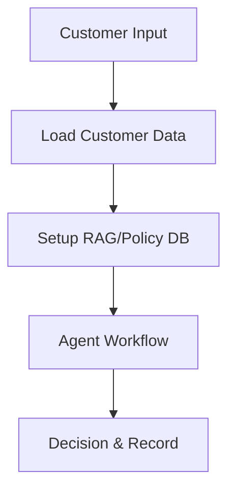

# Loan Processing System: Design Document

---

## 1. Introduction

### Purpose
This system automates loan decision-making by integrating customer data, policy retrieval, and risk assessment. It ensures compliance with internal lending policies and regulatory requirements, especially for non-Singaporean applicants.

### Scope
- **Inputs**: Customer ID or name.
- **Outputs**: Loan decision (approved/rejected), risk rating, interest rate, and formal letter.
- **Key Features**:
  - Customer data aggregation from multiple CSV sources.
  - Policy retrieval using RAG (Retrieval-Augmented Generation) from PDF documents.
  - Automated risk assessment and decision enforcement for high-risk cases.

---

## 2. System Overview

### High-Level Architecture


- **Data Layer**: CSV files for customer data, PDFs for policies.
- **Processing Layer**: Agents for data retrieval, policy analysis, and decision-making.
- **Output Layer**: JSON decision records and formal letters.

---

## 3. Detailed Design

### 3.1 Core Components

#### **1. Customer Data Loader**
- **Function**: `load_customer_data(customer_input)`
- **Inputs**: Customer ID or name.
- **Process**:
  - Loads data from `credit_scores.csv`, `account_status.csv`, and `pr_status.csv`.
  - Validates and merges data into a single customer object.
  - Enforces PR status checks for non-Singaporean applicants.
- **Output**: Customer dictionary with all attributes.

#### **2. RAG/Policy Retrieval**
- **Function**: `setup_rag()` and `build_policy_tool(policy_db)`
- **Inputs**: PDF policy documents.
- **Process**:
  - Splits PDFs into chunks using `RecursiveCharacterTextSplitter`.
  - Builds a FAISS index with `SentenceTransformerEmbeddings`.
  - Provides a `PolicyRetriever` tool for agents to query policies.
- **Output**: FAISS index for semantic search.

#### **3. Agent Workflow**
- **Agents**:
  - **Data Retrieval Agent**: Summarizes customer data.
  - **Policy Analyst**: Retrieves and interprets relevant policies.
  - **Loan Decision Agent**: Makes final decisions based on data and policies.
- **Tasks**:
  - `fetch_customer`: Extracts customer attributes.
  - `extract_policies`: Summarizes policy rules.
  - `make_decision`: Determines risk, rate, and decision.

#### **4. Decision Enforcement**
- **Hard Rule**: Non-Singaporeans without PR status are auto-rejected as "High Risk".
- **Output**: JSON with decision, risk, rate, and formal letter.

---

### 3.2 Data Flow
1. **Input**: Customer ID/name → `load_customer_data()`.
2. **Data Aggregation**: Merges CSV data into a customer object.
3. **Policy Retrieval**: RAG indexes PDFs → `PolicyRetriever` tool.
4. **Agent Processing**: Agents collaborate to analyze data and policies.
5. **Decision**: Enforces rules → records decision in `loan_decisions.json`.

---

## 4. Dependencies
- **Libraries**:
  - `pandas`: Data manipulation.
  - `FAISS`/`SentenceTransformerEmbeddings`: RAG implementation.
  - `crewai`: Agent orchestration.
  - `langchain`: Document loading and splitting.
- **Data Files**:
  - CSV files: `credit_scores.csv`, `account_status.csv`, `pr_status.csv`.
  - PDF files: Policy documents in `/policies`.

---

## 5. Testing Strategy
- **Unit Tests**:
  - Validate `load_customer_data()` for edge cases (missing data, duplicates).
  - Test RAG setup and policy retrieval accuracy.
- **Integration Tests**:
  - End-to-end workflow with mock customer data.
  - Verify decision enforcement for high-risk cases.
- **Manual Validation**:
  - Review formal letters and JSON outputs for correctness.

---

## 6. Deployment/Usage
### Prerequisites
- Python 3.8+
- Install dependencies: `pip install pandas crewai langchain faiss-cpu sentence-transformers`

### How to Run
1. Place CSV files in `/data` and PDFs in `/policies`.
2. Execute: `python loan_processor.py --input <customer_id_or_name>`.

### Example Output
```json
{
  "decision": "rejected",
  "risk": "High Risk",
  "rate": null,
  "customer_name": "John Doe",
  "nationality": "Indian",
  "pr_status": "No"
}
```

---

## 7. Future Considerations
- **Scalability**: Replace CSV/PDF storage with a database (e.g., PostgreSQL).
- **Monitoring**: Add logging for agent performance and decision audits.
- **Extensibility**: Support additional policy types (e.g., dynamic risk models).

---