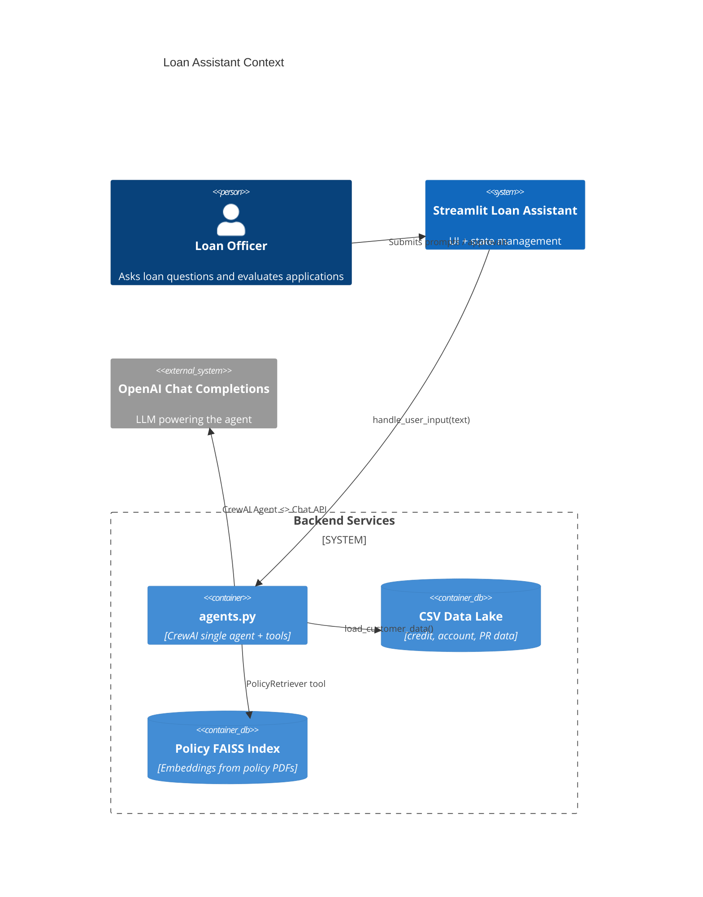
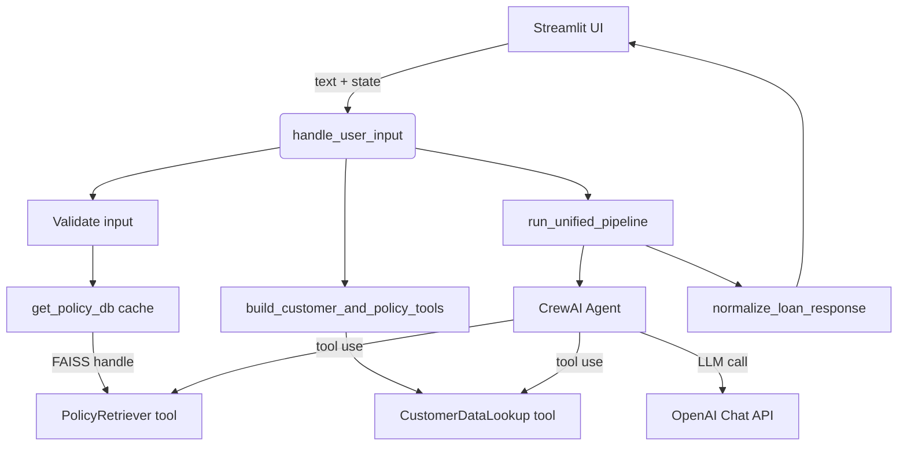

# Loan Assistant Architecture

## 1. Context Overview
The system is an internal-facing Streamlit application that routes every user request through a single CrewAI agent. The agent can access two internal tools: customer data lookup (CSV-backed) and a FAISS-powered Retrieval-Augmented Generation (RAG) index over policy PDFs. The agent produces structured JSON that Streamlit renders along with human-review controls.

## 2. Component Breakdown
| Component | Responsibility | Key Tech |
|-----------|----------------|----------|
| `app.py` | Streamlit UI, session state, approval workflow, stats sidebar, policy evidence display | Streamlit, Python |
| `agents.py` | Data access, FAISS caching, tool registration, unified agent orchestration, standardized error payloads | CrewAI, LangChain, pandas, SentenceTransformerEmbeddings |
| `/data/*.csv` | Source-of-truth tables for credit scores, account status, PR status | CSV, pandas |
| `/policies/*.pdf` | Official lending policies indexed for RAG | PDF + FAISS |
| `/prompts/unified_agent.md` | Behavioral contract for the LLM agent | Markdown prompt |

## 3. Logical Architecture

## 4. Deployment View
- **Runtime**: local Streamlit session (developer laptop or internal VM).
- **Environment variables**: `.env` with `OPENAI_API_KEY`.
- **File dependencies**: expects `./data`, `./policies`, `./prompts`, and `./doc` inside repo root.
- **Network**: outbound HTTPS to OpenAI only (no other external traffic).

## 5. Data Contracts
- Customer tool returns JSON object with `ID`, `Name`, `Nationality`, `AccountStatus`, `CreditScore`, `PRStatus`.
- Unified agent must emit the schema defined in `prompts/unified_agent.md`. Streamlit trusts that structure when rendering.
- UI-level errors always use `{"type": "error", "error": <code>, "message": 
}` via `error_response`, so the front end can surface consistent warnings.

## 6. Caching Strategy
- `load_prompt` and `_load_customer_tables` are wrapped in `functools.lru_cache` so prompt templates and CSV slices are only read once per process.
- `get_policy_db` memoizes the FAISS vector store in `_POLICY_DB`, preventing repeated PDF parsing as users submit multiple questions.
- Streamlit session state keeps `pending_application`, `officer_*` fields, and `decision_stats` so officer actions survive reruns triggered by widget interaction.

## 7. Observability
- `logging` module prints to stdout and `loan_agents.log` (if configured by the user) with INFO-level events for FAISS caching and policy retrieval errors.

## 8. Future Enhancements
1. Replace CSVs with a relational read replica (PostgreSQL) and add caching/invalidation.
2. Persist officer decisions to a database or audit ledger.
3. Wrap FAISS cache in a background task to pre-build at startup.
